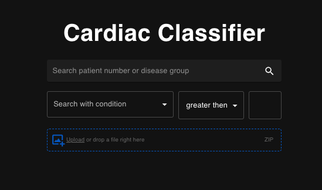
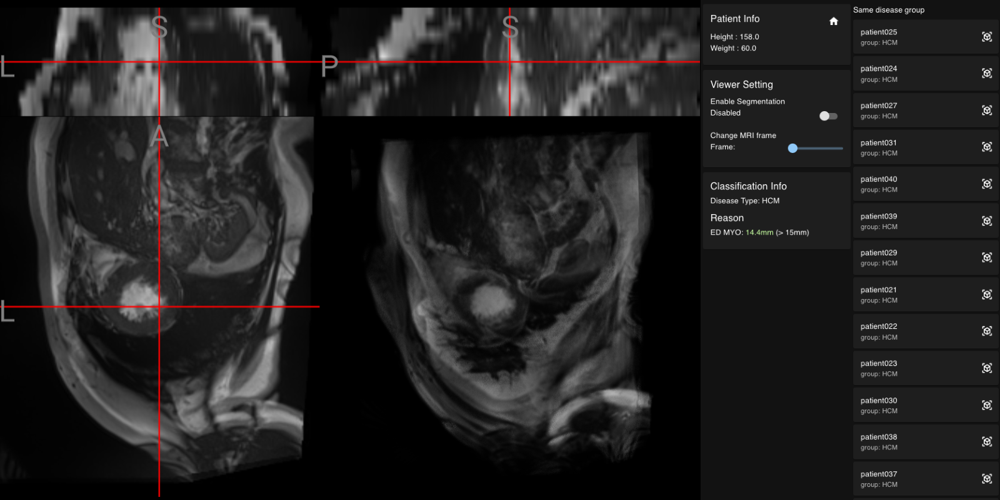
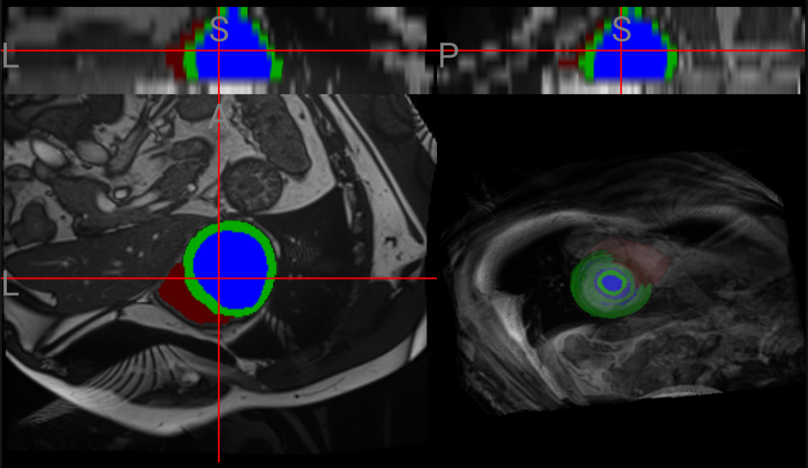
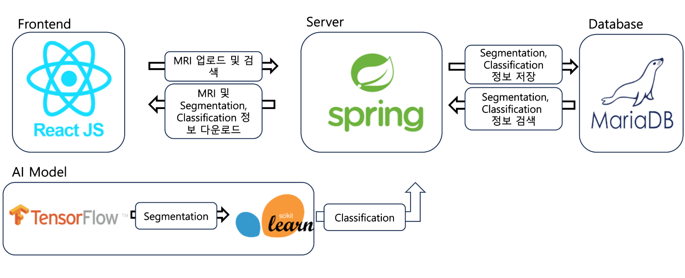

### 1. 프로젝트 소개
#### AI 기반 4d cardiac MRI 분석 솔루션 




4d cardiac MRI를 분석하는 segmentation model과 classification model을 탑재하여 다음과 같은 병을 사전진단 할 수 있다.

- MINF(Myocardial Infarction): 심근경색
- DCM(Dilated Cardiomyopathy): 확장성 심근증
- HCM(Hypertrophic Cardiomyopathy): 비후성 심근병증
- ARV(Abnormal Right Ventricle): 우심실 이상

### 2. 팀소개

양준석, 개발총괄 및 시각화 개발

박현수
- Multi-scale hierarchical vision transformer
- FC Multi-scale Residual DenseNets

이수빈
- Fully Convolutional Transformer
- Modified 2D U-Net

### 3. 시스템 구성도


- React JS를 사용하여 Frontend를 구성하였으며, niivue 패키지를 사용하여 4D Cardiac MRI Viewer를 제작
- Spring을 사용하여 Web Server를 제작
- TenserFlow를 사용하여 Segmentation 모델을 불러온 후 MRI로 부터 LV, RV, MYO에 대한 Segmentation 결과와 각 부분의 nifti 파일을 생성
- scikit-learn을 사용하여 Classification 모델을 불러온 후  Segmentation 결과 데이터를 기반으로 병명을 유추함
- MariaDB를 통해 LV, RV, MYO에 대한 Segmentation 결과와 Classification 결과인 병명을 저장 및 검색

### 4. 소개 및 시연 영상

[](https://www.youtube.com/watch?v=opF18loV1Rs)

### 5. 설치 및 사용법
본 프로젝트의 경우 Mac OS를 기준으로 환경설정이 이루어져있습니다.

#### python 가상환경 설정
```
conda env create -f environment.yml
```
가상환경의 이름을 classifierVenv로 생성합니다. (다른 이름을 사용할 경우 spring 동작에서 에러가 발생합니다.)

#### web
```
cd web
npm install
npm run start
```

#### DB
1. MariaDB 설치
```
brew install mariadb
```
2. 접속
```
mysql -u root -p
```
3. 데이터베이스 추가
```mariadb
CREATE DATABASE cohang;
USE cohang;
```
Nocha123이라는 비밀번호 대신 다른 비밀번호 설정 시
[application.properties](src%2Fmain%2Fresources%2Fapplication.properties) 파일의 spring.datasource.password 변경이 필요합니다.
4. 테이블 추가
```mariadb
CREATE TABLE `cardiac_segmentation` (
`id` int NOT NULL AUTO_INCREMENT,
`name` varchar(20) DEFAULT NULL,
`ED_vol_LV` float DEFAULT NULL,
`ED_vol_RV` float DEFAULT NULL,
`EF_LV` float DEFAULT NULL,
`EF_RV` float DEFAULT NULL,
`ED_max_MTH` float DEFAULT NULL,
`disease_group` varchar(10) DEFAULT NULL,
PRIMARY KEY (`id`)
) ENGINE=InnoDB AUTO_INCREMENT=210 DEFAULT CHARSET=utf8mb4 COLLATE=utf8mb4_0900_ai_ci
```

#### server
JDK 버전은 Java 18.0.2를 사용합니다.
[CardiacRendererApplication.java](src%2Fmain%2Fjava%2Fpnu%2Fcohang%2Fcardiacrenderer%2FCardiacRendererApplication.java) 파일을 Intelij IDE를 통해 서버를 실행시킵니다.

#### 사용법
localhost:3000에 접속

https://humanheart-project.creatis.insa-lyon.fr/database/#collection/637218c173e9f0047faa00fb
위 링크에서 database 폴더 다운


환자의 정보를 압축 후 메인화면의 파일 업로더를 통해 업로드